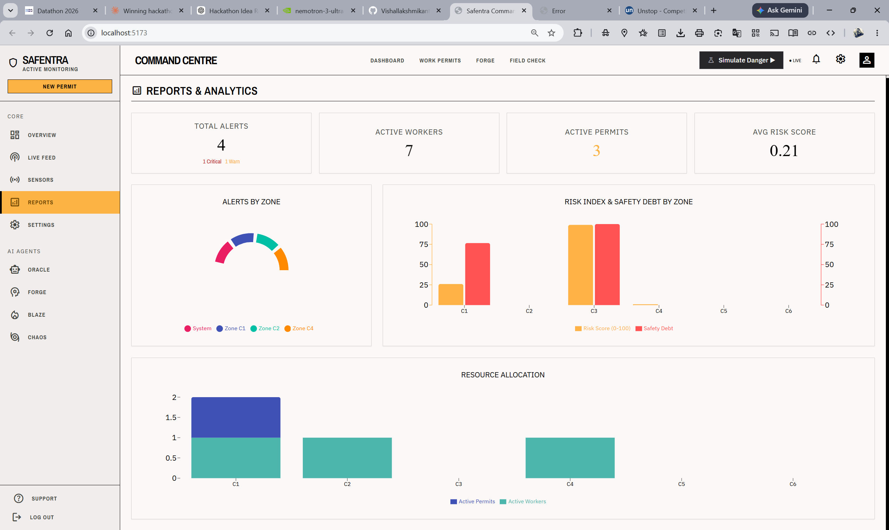
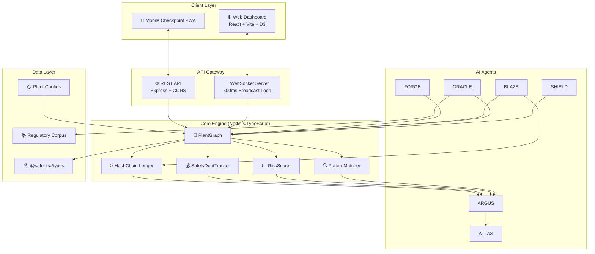
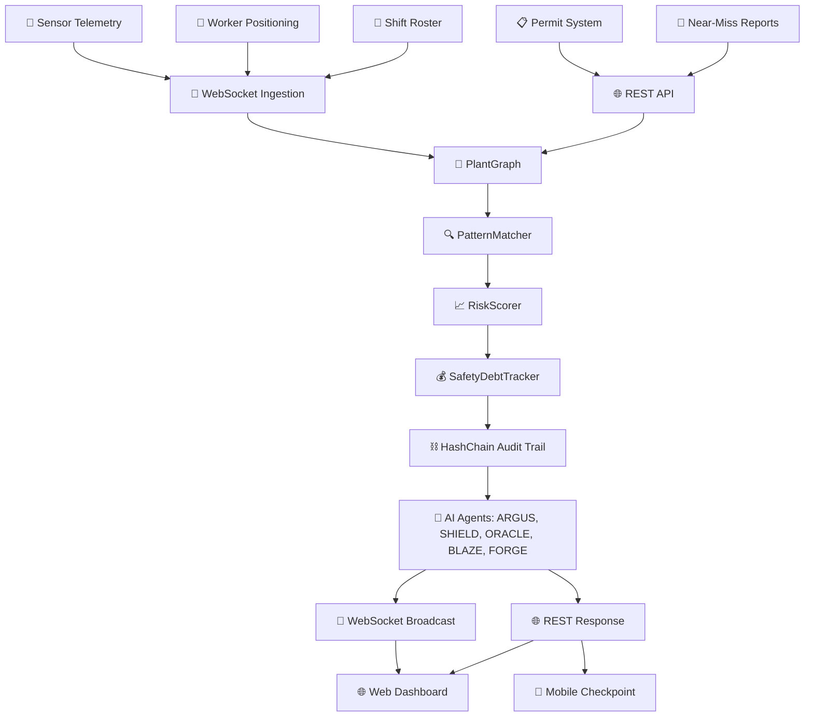
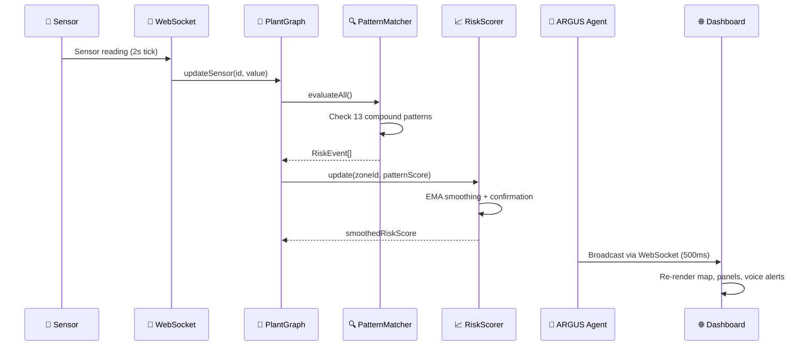

<div align="center">

# 🏭 Safentra
**Compound Risk Detection Platform for Industrial Safety**

[](https://unstop.com/hackathons/et-ai-hackathon-2-0)
[-%2300D4AA?style=for-the-badge)](https://unstop.com/hackathons/et-ai-hackathon-2-0)
[](#)
[](LICENSE)
<br/>
[](https://www.typescriptlang.org/)
[](https://react.dev/)
[](https://nodejs.org/)
[](https://vitejs.dev/)
[](https://tailwindcss.com/)

*No single alarm fires. That's the point. Safentra listens for the silence between alarms.*

</div>

---

## 🏆 Hackathon Details

| Detail | Information |
|--------|-------------|
| **Hackathon** | **ET AI Hackathon 2.0** — Nation-scale innovation challenge by Economic Times & Unstop |
| **Phase** | **Round 2 — Prototype Build Sprint** |
| **Focus** | Business Innovation, Social Impact & Open Innovation domains |
| **Goal** | Transform ideas into impactful AI products; discover India's brightest AI talent |
| **Why this fits** | Safentra uses advanced AI (RAG, Knowledge Graphs, Pattern Matching) for real-world industrial impact, saving lives by predicting compound hazards. |

## 👥 Team VibeSync

| Member | Role | GitHub | LinkedIn |
|--------|------|--------|----------|
| **Vishal Lakshmikanthan** | Full-Stack Engineer, Architecture & Backend Lead | [@Vishallakshmikanthan](https://github.com/Vishallakshmikanthan) | [LinkedIn](https://linkedin.com/in/vishallakshmikanthan) |
| **Sneha C** | Frontend Engineer, UI/UX & Mobile Lead | [@CSNEHA20](https://github.com/CSNEHA20) | [LinkedIn](https://linkedin.com/in/csneha20) |

---

## 📸 Prototype Preview

<div align="center">
  
  
  
  
  
  
  
  
</div>

---

## 📖 Project Overview

**Safentra** is a **real-time compound risk detection platform** designed for high-hazard industrial environments — starting with **coke oven batteries** in integrated steel plants. It fuses **live sensor telemetry, worker positioning, permit-to-work status, and shift-changeover dynamics** into a unified knowledge graph. It then applies **13 compound risk patterns** (codified from DGMS/OISD regulations and historical incidents like the **Vizag gas leak**) to surface *emergent* risks that single-sensor alarms miss.

---

## ⚠️ Problem Statement

### Industrial Safety Gap in High-Hazard Plants
Most industrial safety software is **reactive and single-variable**: a gas sensor crosses a threshold, an alarm sounds. 

| Problem | Impact |
|---------|--------|
| **Siloed monitoring** | Gas detectors, permit systems, worker tracking, and shift rosters operate in isolation. No unified situational awareness. |
| **Threshold-only alarms** | Binary high/low alerts miss *compound* precursors. Late detection; false confidence when sensors read "normal". |
| **Paper-based permits** | Hot work, confined entry, isolation permits lack real-time risk context. |
| **Shift changeover blind spots**| Incoming/outgoing crew handover creates 15–30 min visibility gaps with zero monitoring. |
| **No institutional memory** | Near-misses go unreported or unanalyzed. Recurring patterns never codified into prevention. |
| **Fragile Audit Trails** | Paper logs, spreadsheets, disconnected systems mean tampering is possible. |

**The Vizag Reference Incident (LG Polymers, 2020)**
The Vizag tragedy wasn't triggered by one sensor breaching its limit — it was the confluence of factors. Gas pressure creeping up + three workers entering a confined space + shift changeover + a hot-work permit being prepared next door. **Safentra detects the *pattern*, not just the threshold.**

---

## 💡 Proposed Solution

Safentra models the plant as a live knowledge graph and continuously runs causal subgraph matching to find dangerous patterns encoded from real incident investigations. 

### Six AI Agents Working in Concert

| Agent | Codename | Role | Key Capability |
|-------|----------|------|----------------|
| **ARGUS** | 🧠 **Knowledge Graph** | In-memory plant graph + 13 compound risk patterns | Evaluates patterns every 500ms; temporal smoothing |
| **ATLAS** | 🗺️ **Live Visualization** | Plant map with risk heatmap, worker dots | Real-time WebSocket-driven UI |
| **SHIELD** | 🛡️ **Permit Intelligence** | Context-aware permit validation | Blocks hot work if adjacent gas elevated |
| **ORACLE** | 🔮 **Regulatory RAG Agent**| RAG over DGMS/OISD corpus (Nemotron AI) | Answers safety queries with regulatory citations |
| **BLAZE** | 🚨 **Emergency Orchestrator**| DGFASLI-compliant incident report & evac | One-click emergency report and alerts |
| **FORGE** | 🔨 **Pattern Discovery** | Mines free-text near-miss reports | NLP extraction to candidate patterns |

---

## ✨ Features

- **🕸️ Knowledge Graph**: In-memory graph (Zones ↔ Sensors ↔ Workers ↔ Permits).
- **📊 13 Compound Patterns**: Codified from DGMS/OISD + Vizag; each with regulatory citation & risk score.
- **📈 Temporal Risk Smoothing**: EMA (α=0.3) + 3-tick confirmation window prevents flicker.
- **💰 Safety Debt Tracking**: Time-integrated risk accumulation per zone.
- **⛓️ Hash-Chained Audit Ledger**: Tamper-evident log (SHA-256 chain) of every event, permit action, and sensor reading.
- **🌐 Real-time WebSocket**: 500ms state broadcast; auto-reconnect.
- **🎭 Chaos/War-Room Mode**: Live scenario injection API.
- **🏭 Multi-Plant Configurator**: JSON Schema-driven plant onboarding.
- **📱 Mobile QR Checkpoint**: PWA where a field worker scans QR → SHIELD validates permit → clear/block.
- **🗣️ Voice Alerts**: Web Speech API announces critical alerts hands-free.

---

## 🏗️ Architecture Overview

### Complete System Architecture



### Data Flow



### Application Workflow (Real-Time Risk Detection)



---

## 🛠️ Technology Stack

| Category | Technologies |
|----------|-------------|
| **Frontend** | React 19, Vite 8.1, TailwindCSS 3.4, D3.js, Recharts, Zustand 5, Three.js, Lucide React |
| **Backend** | Node.js 20, Express, WebSocket (ws), TypeScript 5.4 |
| **AI / ML** | NVIDIA Nemotron AI API (via Anthropic SDK layer), RAG |
| **Database** | In-memory Knowledge Graph, Hash-Chain Ledger (Append-Only Audit Trail) |
| **DevOps & Tooling** | Concurrently, UUID, Ajv (JSON Schema), Dotenv |

---

## 📂 Folder Structure

| Path | Description |
|------|-------------|
| `apps/server/` | Backend (Node.js/Express/WebSocket, AI Agents, Graph Engine, Ledgers) |
| `apps/web/` | Web Dashboard (React, Vite, D3, Recharts, Zustand) |
| `apps/mobile-checkpoint/` | Mobile PWA (QR Scanner, SHIELD validation) |
| `packages/types/` | Shared TypeScript interfaces and definitions |
| `data/corpus/` | RAG regulatory documents (OISD, Factory Act, etc.) |
| `data/plant-configs/` | JSON Plant configurations and layouts |
| `data/scenarios/` | Timeline events for Simulation & Chaos Mode |

---

## ⚙️ Environment Variables

The project uses a monorepo setup with separate `.env` files. 

**Server (`apps/server/.env`)**
```env
PORT=3001
NODE_ENV=production
CORS_ORIGINS=http://localhost:5173
NEMOTRON_API_KEY=nvapi-XXXX-XXXX-XXXX
```

**Web (`apps/web/.env`)**
```env
VITE_API_URL=http://localhost:3001
VITE_WS_URL=ws://localhost:3001
```

---

## 🚀 Installation & Running Locally

### Prerequisites
- Node.js (v20+)
- npm or yarn

### Setup

1. **Clone the repository:**
   ```bash
   git clone https://github.com/Vishallakshmikanthan/Safentra.git
   cd Safentra
   ```

2. **Install dependencies:**
   ```bash
   npm install
   ```

3. **Configure Environment Variables:**
   - Update `apps/server/.env` with your API keys.
   - Update `apps/web/.env` to point to the server.

4. **Run the Application (Development Mode):**
   ```bash
   npm run dev
   ```
   *This concurrently starts both the server and the web dashboard.*

### Build for Production
```bash
npm run build
```

---

## 📡 API Documentation

### WebSocket Events (ws://localhost:3001)
- `state_update`: Emitted every 500ms containing complete graph state.
- `risk_event`: Emitted when a compound pattern matches.
- `permit_blocked`: Broadcast when SHIELD intercepts a permit.

### REST Endpoints (http://localhost:3001)
| Method | Endpoint | Description |
|--------|----------|-------------|
| `POST` | `/api/permits` | Submit a new permit for SHIELD validation |
| `POST` | `/api/checkpoint/scan` | Field worker QR scan |
| `POST` | `/api/oracle/query` | RAG query over safety regulations |
| `POST` | `/api/forge/submit-near-miss`| Submit a near-miss report for pattern discovery |
| `POST` | `/api/simulation/start` | Trigger a pre-recorded incident timeline |
| `GET`  | `/api/ledger/verify` | Verify the SHA-256 hash-chain audit trail |

---

## 🔮 Future Improvements

1. **IoT Edge Integration:** Connect real OPC-UA/MQTT ingestion streams directly from industrial PLC systems.
2. **Multi-Tenancy (SaaS):** Expand from a single plant environment to RBAC controlled multi-tenant workspaces.
3. **Advanced AI Vision:** Incorporate edge computer vision to augment worker positioning and PPE detection.

---

<div align="center">
  <i>Built with ❤️ for safety by Team VibeSync</i>
</div>
