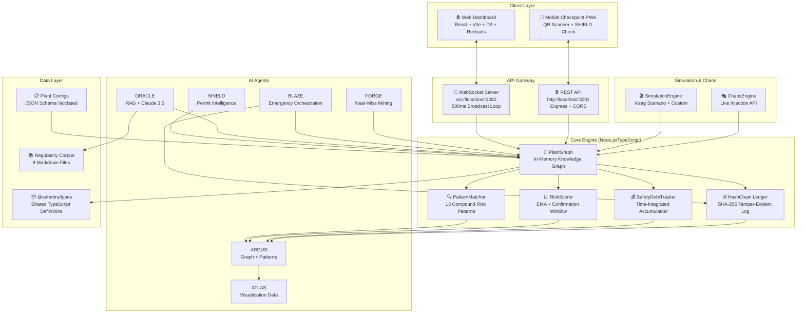
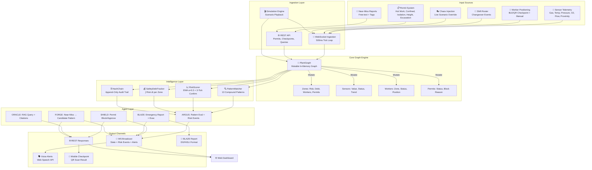
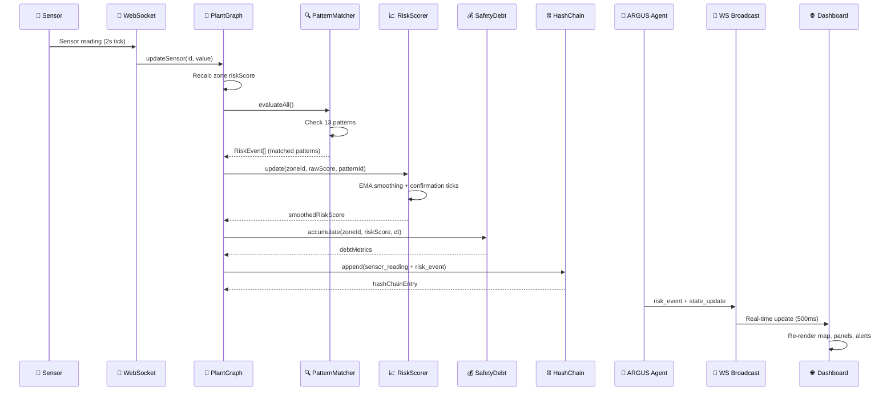
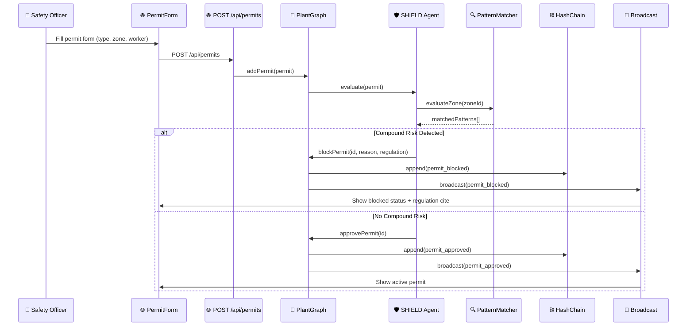
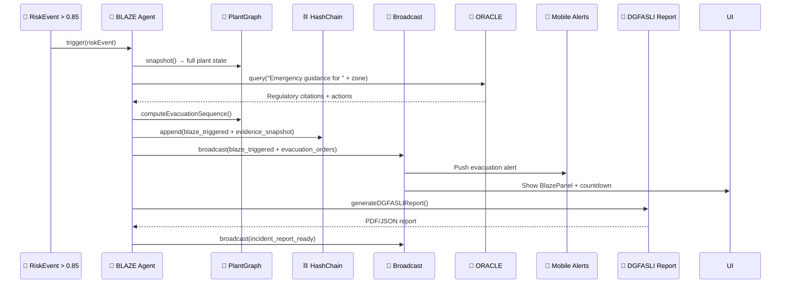
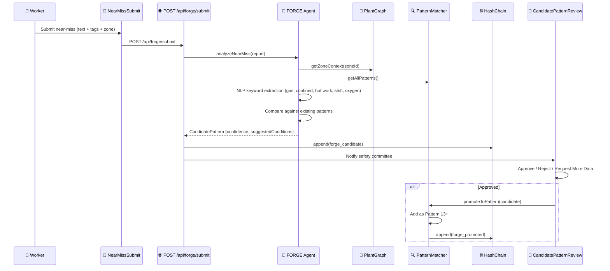

# 🏭 Safentra — Compound Risk Detection Platform for Industrial Safety

> **🚧 UNDER CONSTRUCTION — Actively building for ET AI Hackathon 2.0 Round 2** 🚧

[](https://unstop.com/hackathons/et-ai-hackathon-2-0)
[-%2300D4AA?style=for-the-badge)](https://unstop.com/hackathons/et-ai-hackathon-2-0)
[](https://github.com/Vishallakshmikanthan/Safentra)
[](https://github.com/Vishallakshmikanthan/Safentra)
[](LICENSE)
[](https://www.typescriptlang.org/)
[](https://react.dev/)
[](https://nodejs.org/)
[](https://developer.mozilla.org/en-US/docs/Web/API/WebSocket)
[](https://d3js.org/)
[](https://recharts.org/)
[](https://zustand-demo.pmnd.rs/)
[](https://vitejs.dev/)
[](https://tailwindcss.com/)
[](https://www.anthropic.com/)
[](https://railway.app/)
[](https://vercel.com/)

---

## 🏆 Hackathon Details

| Detail | Information |
|--------|-------------|
| **Hackathon** | **ET AI Hackathon 2.0** — Nation-scale innovation challenge by Economic Times & Unstop |
| **Phase** | **Round 2 — Prototype Build Sprint** (Phase 1 results announced 22nd June before 3:00 PM) |
| **Focus** | Business Innovation, Social Impact & Open Innovation domains |
| **Journey** | Online AI Assessment → Prototype Build Sprint → Grand Finale |
| **Goal** | Transform ideas into impactful AI products; discover India's brightest AI talent |

> **Note:** We cleared **Phase 1 (Online AI Assessment)** and are now building the **Round 2 prototype** for the intensive build sprint.

---

## 👥 Team VibeSync

| Member | Role | GitHub | LinkedIn |
|--------|------|--------|----------|
| **Vishal Lakshmikanthan** | Full-Stack Engineer, Architecture & Backend Lead | [@Vishallakshmikanthan](https://github.com/Vishallakshmikanthan) | [LinkedIn](https://linkedin.com/in/vishallakshmikanthan) |
| **Sneha C** | Frontend Engineer, UI/UX & Mobile Lead | [@CSNEHA20](https://github.com/CSNEHA20) | [LinkedIn](https://linkedin.com/in/csneha20) |

---

## 📖 Project Description

**Safentra** is a **real-time compound risk detection platform** designed for high-hazard industrial environments — starting with **coke oven batteries** in integrated steel plants. It fuses **live sensor telemetry, worker positioning, permit-to-work status, and shift-changeover dynamics** into a unified knowledge graph, then applies **13 compound risk patterns** (codified from DGMS/OISD regulations and historical incidents like the **Vizag gas leak**) to surface *emergent* risks that single-sensor alarms miss.

### The Core Insight
> **Single-sensor thresholds fail to catch compound hazards.** The Vizag tragedy wasn't triggered by one sensor breaching its limit — it was the *confluence* of: gas pressure creeping up + three workers entering a confined space + shift changeover + a hot-work permit being prepared next door. **Safentra detects the *pattern*, not just the threshold.**

---

## ⚠️ Problem Statement

### Industrial Safety Gap in High-Hazard Plants
| Problem | Impact |
|---------|--------|
| **Siloed monitoring** — Gas detectors, permit systems, worker tracking, and shift rosters operate in isolation | No unified situational awareness |
| **Threshold-only alarms** — Binary high/low alerts miss *compound* precursors | Late detection; false confidence when all sensors read "normal" |
| **Paper-based permits** — Hot work, confined entry, isolation permits lack real-time risk context | Permits approved despite adjacent zone hazards |
| **Shift changeover blind spots** — Incoming/outgoing crew handover creates 15–30 min visibility gaps | Peak risk window with zero monitoring |
| **No institutional memory** — Near-misses go unreported or unanalyzed | Recurring patterns never codified into prevention |
| **Audit trails are fragile** — Paper logs, spreadsheets, disconnected systems | Tampering possible; forensic reconstruction impossible |

### The Vizag Reference Incident (LG Polymers, 2020)
- **Root cause:** Styrene monomer tank polymerization due to temperature rise + inhibitor depletion + no circulation
- **Compound factors missed:** Sensor drift + maintenance backlog + shift handover gap + no remote monitoring
- **Regulatory response:** DGMS Circular 2022/11, OISD-GDN-169, OISD-STD-105 — mandating *compound risk assessment*

---

## 💡 Solution: Safentra Platform

### Six AI Agents Working in Concert

| Agent | Codename | Role | Key Capability |
|-------|----------|------|----------------|
| **ARGUS** | 🧠 **Knowledge Graph & Pattern Engine** | In-memory plant graph + 13 compound risk patterns | Evaluates *all* patterns every 500ms; temporal smoothing (EMA + confirmation window) |
| **ATLAS** | 🗺️ **Live Plant Visualization** | D3.js plant map with risk heatmap, worker dots, permit zones | Real-time WebSocket-driven; pulsing critical zones; zone polygons from config |
| **SHIELD** | 🛡️ **Permit-to-Work Intelligence** | Context-aware permit validation & blocking | Blocks hot work if adjacent gas elevated; cites DGMS/OISD regulation |
| **ORACLE** | 🔮 **Regulatory Intelligence Agent** | RAG over DGMS/OISD corpus + Anthropic Claude | Answers "Is this permit safe?" with citations; auto-queries on risk events |
| **BLAZE** | 🚨 **Emergency Orchestrator** | DGFASLI-compliant incident report + evacuation sequencing | One-click trigger; generates report, alerts, routes, assembly counts |
| **FORGE** | 🔨 **Pattern Discovery from Near-Misses** | Mines free-text near-miss reports → candidate patterns | NLP extraction → pattern validation → promote to ARGUS Pattern 13+ |

### Platform Capabilities

| Capability | Description |
|------------|-------------|
| **🕸️ Knowledge Graph** | In-memory graph: Zones ↔ Sensors ↔ Workers ↔ Permits ↔ Adjacencies |
| **📊 13 Compound Patterns** | Codified from DGMS/OISD + Vizag; each with regulatory citation & risk score |
| **📈 Temporal Risk Smoothing** | EMA (α=0.3) + 3-tick confirmation window prevents flicker |
| **💰 Safety Debt Tracking** | Time-integrated risk accumulation per zone (area under risk curve) |
| **⛓️ Hash-Chained Audit Ledger** | Tamper-evident log (SHA-256 chain) of every event, permit action, sensor reading |
| **🌐 Real-time WebSocket** | 500ms state broadcast; auto-reconnect; subscription model |
| **🎭 Chaos/War-Room Mode** | Live scenario injection by judges/presenters — *not scripted* |
| **🏭 Multi-Plant Configurator** | JSON Schema-driven plant onboarding (coke oven, blast furnace, chemical, etc.) |
| **📱 Mobile QR Checkpoint (PWA)** | Field worker scans QR → SHIELD validates permit + zone risk → clear/block/escort |
| **🗣️ Voice Alerts** | Web Speech API announces critical alerts hands-free |
| **🎬 Vizag Replay Scenario** | 12-event timeline reproducing compound risk ramp to 94% at T+41.5s |

---

## 🏗️ Project Architecture

### High-Level System Architecture



### Monorepo Structure

```
safentra/
├── 📦 apps/
│   ├── 🖥️ server/                 # Backend: Express + WebSocket + Agents
│   │   ├── src/
│   │   │   ├── index.ts           # Entry: REST + WS + Simulation + Chaos
│   │   │   ├── graph/
│   │   │   │   ├── PlantGraph.ts       # Core knowledge graph
│   │   │   │   ├── PatternMatcher.ts   # 13 pattern implementations
│   │   │   │   ├── RiskScorer.ts       # EMA + confirmation ticks
│   │   │   │   └── SafetyDebt.ts       # Debt accumulation + decay
│   │   │   ├── websocket/
│   │   │   │   └── PlantWebSocketServer.ts  # 500ms broadcast loop
│   │   │   ├── simulation/
│   │   │   │   ├── SimulationEngine.ts   # Timeline event player
│   │   │   │   └── ChaosEngine.ts        # Live scenario injection
│   │   │   ├── agents/
│   │   │   │   ├── oracle.ts      # RAG + Anthropic Claude
│   │   │   │   ├── blaze.ts       # Emergency orchestration
│   │   │   │   └── forge.ts       # Near-miss pattern mining
│   │   │   ├── ledger/
│   │   │   │   └── HashChain.ts   # SHA-256 chained audit log
│   │   │   └── routes/            # REST endpoints per domain
│   │   └── package.json
│   │
│   ├── 🌐 web/                    # Frontend: React 19 + Vite + Tailwind
│   │   ├── src/
│   │   │   ├── components/
│   │   │   │   ├── Atlas/              # PlantMap (D3), ZonePolygon, WorkerDot
│   │   │   │   ├── CommandCentre/      # Dashboard, SafetyDebtPanel, AlertFeed
│   │   │   │   ├── Shield/             # PermitForm, PermitValidator
│   │   │   │   ├── Oracle/             # OraclePanel, chat interface
│   │   │   │   ├── Blaze/              # BlazePanel, IncidentReport
│   │   │   │   ├── Forge/              # NearMissSubmit, CandidatePatternReview
│   │   │   │   ├── Chaos/              # ChaosBuilder (live injection UI)
│   │   │   │   ├── Shared/             # Reusable UI components
│   │   │   │   └── Modules/            # Feature modules
│   │   │   ├── store/
│   │   │   │   └── plantStore.ts       # Zustand + WebSocket sync
│   │   │   ├── hooks/
│   │   │   │   ├── useWebSocket.ts     # Auto-reconnect WS client
│   │   │   │   └── useVoiceAlerts.ts   # Web Speech API
│   │   │   └── types/                  # Frontend-specific types
│   │   └── package.json
│   │
│   └── 📱 mobile-checkpoint/      # PWA: QR Scanner + SHIELD Check
│       └── src/
│           ├── App.tsx
│           └── useCamera.ts
│
├── 📦 packages/
│   └── types/                     # @safentra/types — Shared TS definitions
│       └── src/index.ts           # All domain types (Zone, Sensor, Worker, Permit, etc.)
│
├── 📁 data/
│   ├── corpus/                    # 8 regulatory/incident markdown files
│   ├── plant-configs/
│   │   ├── coke-oven-plant.json   # 6-zone default plant
│   │   └── schema.json            # JSON Schema Draft 7 for validation
│   └── scenarios/
│       ├── vizag.json             # 12-event replay timeline
│       └── chaos-templates.json   # Chaos mode presets
│
├── 🖼️ images/                     # Screenshots for README
├── 📋 implementation_plan.md      # 16-phase build plan
├── 📋 Safentra-Build-Guide.md     # Detailed architecture guide
└── 📦 package.json                # Root workspace config
```

---

## 🔄 Data Flow Diagram



---

## 🌊 Flow Diagrams

### 1. Real-Time Risk Detection Flow



### 2. SHIELD Permit Validation Flow



### 3. BLAZE Emergency Orchestration Flow



### 4. FORGE Near-Miss Pattern Discovery Flow



---

## 🎯 The 13 Compound Risk Patterns

| # | Pattern Name | Trigger Conditions | Risk Score | Regulatory Reference |
|---|--------------|-------------------|------------|---------------------|
| **01** | **Hot Work Near Gas Elevation** | Hot work permit + adjacent zone gas pressure > normal | 0.72 | OISD-STD-105 §6.2 |
| **02** | **Confined Entry + Abnormal Process** | Workers in confined space + sensor abnormal in same zone | 0.81 | OISD-GDN-169 §4.3 |
| **03** | **Maintenance + Gas Holder Pressure** | Electrical isolation permit + adjacent gas holder pressure elevated | 0.68 | OISD-GDN-169 §7 |
| **04** | **Shift Changeover + Active Permits** | Shift changeover active + high-risk permits active | 0.75 | DGMS Circular 2023/04 |
| **05** | **Multi-Worker Confined Space** | ≥3 workers in confined space + no standby observer | 0.78 | OISD-GDN-169 §5.1 |
| **06** | **Gas Pressure Creep + Permit** | Gas pressure rising trend (3+ ticks) + any permit in zone | 0.65 | OISD-STD-105 §4.4 |
| **07** | **Oxygen Depletion + Hot Work** | O₂ < 19.5% + hot work permit in same/adjacent zone | 0.85 | DGMS Circular 2022/11 |
| **08** | **H₂S Elevation + Confined Entry** | H₂S > 10 ppm + confined space entry permit active | 0.88 | OISD-GDN-169 §4.2 |
| **09** | **CO Accumulation + Maintenance** | CO > 25 ppm + electrical isolation permit | 0.70 | IE Rules 1956 |
| **10** | **Temperature Spike + Gas Pressure** | Temp > 70°C + gas pressure > 1.2× normal | 0.73 | OISD-STD-105 §6.3 |
| **11** | **Flow Rate Anomaly + Permit** | Flow rate > 150% normal + excavation permit | 0.62 | DGMS Circular 2021/08 |
| **12** | **Vizag Compound Pattern** | Gas pressure rise + 3 workers confined + shift change + adjacent hot work prep | **0.94** | **Vizag Incident Report** |
| **13** | **FORGE-Discovered Pattern** | Dynamically promoted from near-miss reports | Variable | Derived from field data |

> **Pattern 12 (Vizag)** is the *signature demo pattern* — it reproduces the exact compound precursor sequence of the 2020 Vizag gas leak, reaching **94% risk score at T+41.5s** with the 3-tick confirmation window.

---

## 📸 Screenshots

### Command Centre Dashboard

*Main dashboard with plant overview, risk metrics, and real-time alerts*

### ATLAS Plant Map Visualization

*D3.js-rendered plant map with zone polygons, risk heatmap, worker positions, and permit zones*

### SHIELD Permit Management

*Context-aware permit form showing real-time zone risk and SHIELD validation*

### ORACLE Regulatory Intelligence

*AI-powered regulatory query with DGMS/OISD citations and confidence scoring*

### BLAZE Emergency Orchestration

*One-click emergency trigger with evacuation sequencing and DGFASLI report generation*

### FORGE Near-Miss Submission

*Field worker near-miss submission with automatic pattern candidate generation*

### Chaos / War-Room Mode

*Live scenario injection interface for judges/presenters to test real-time detection*

### Safety Debt Panel

*Recharts visualization of time-integrated risk accumulation per zone*

### Mobile Checkpoint PWA

*QR code scanner for field permit validation with SHIELD risk check*

### Audit Ledger Verification

*Tamper-evident hash chain with cryptographic verification*

---

## 🚀 Quick Start

### Prerequisites
- **Node.js 20+** (LTS recommended)
- **npm 10+** (comes with Node)
- **Anthropic API Key** (for ORACLE agent) — get one at [console.anthropic.com](https://console.anthropic.com)

### Installation

```bash
# Clone the repository
git clone https://github.com/Vishallakshmikanthan/Safentra.git
cd Safentra

# Install all workspace dependencies
npm install

# Configure environment variables
cp apps/server/.env.example apps/server/.env
# Edit apps/server/.env and add your ANTHROPIC_API_KEY

# Build shared types package
npm run build:types

# Start development servers (backend + frontend)
npm run dev
```

### Access Points

| Service | URL | Description |
|---------|-----|-------------|
| **Web Dashboard** | http://localhost:5173 | Main command centre |
| **REST API** | http://localhost:3001/api | OpenAPI endpoints |
| **WebSocket** | ws://localhost:3002 | Real-time state stream |
| **Health Check** | http://localhost:3001/health | Server status |

### Run Vizag Demo Scenario

```bash
# In the web dashboard:
# 1. Click "▶ Start Simulation" in the simulation controls
# 2. At ~T+32s, submit a Hot Work permit for Zone C3 via SHIELD panel
# 3. Watch Pattern 12 (Vizag) confirm over 3 ticks → 94% risk
# 4. Observe BLAZE auto-trigger at >0.85 threshold
```

### Run Chaos Mode (Live Judge Demo)

```bash
# In the web dashboard:
# 1. Open "Chaos Builder" panel (⚡ icon)
# 2. Toggle: "Gas Pressure Spike" + "Workers in Confined Space" + "Shift Changeover"
# 3. Click "Inject Chaos"
# 4. Watch ARGUS detect compound pattern in real-time — NOT scripted!
```

---

## 🛠️ Development Commands

```bash
# Development
npm run dev              # Start both server + web (concurrently)
npm run dev:server       # Backend only (tsx watch)
npm run dev:web          # Frontend only (Vite)

# Building
npm run build            # Build all workspaces
npm run build:server     # Backend only (tsc)
npm run build:web        # Frontend only (vite build)
npm run build:types      # Shared types only

# Testing & Linting
npm run test             # Run all workspace tests
npm run lint             # Lint all workspaces (oxlint)

# Mobile Checkpoint PWA
cd apps/mobile-checkpoint && npm run dev
```

---

## 📦 Deployment

### Frontend → Vercel
```bash
cd apps/web && npm run build
# Connect GitHub repo to Vercel
# Set root directory: apps/web
# Add env vars: VITE_API_URL, VITE_WS_URL
```

### Mobile Checkpoint → Vercel (separate project)
```bash
cd apps/mobile-checkpoint && npm run build
# Deploy as separate Vercel project for clean QR-code URL
```

### Backend → Railway
```bash
# Add railway.toml to apps/server/
# railway login && railway link && railway up
# Set ANTHROPIC_API_KEY in Railway dashboard
```

### Environment Variables

| Variable | Development | Production |
|----------|-------------|------------|
| `ANTHROPIC_API_KEY` | Required for ORACLE | Required |
| `PORT` | 3001 | Railway assigns |
| `WS_PORT` | 3002 | Same as PORT (Railway WS support) |
| `CORS_ORIGINS` | http://localhost:5173 | https://your-vercel-app.vercel.app |
| `VITE_API_URL` | http://localhost:3001 | https://your-railway-app.railway.app |
| `VITE_WS_URL` | ws://localhost:3002 | wss://your-railway-app.railway.app |

---

## 🧪 Testing Checklist (Round 2 Demo Ready)

- [ ] **Vizag Replay** — Starts at 6:47am, reaches 94% risk at T+41.5s, BLAZE triggers
- [ ] **SHIELD Block** — Hot work permit for C3 blocked when C4 gas elevated (Pattern 1)
- [ ] **FORGE Flow** — Submit near-miss → candidate appears → approve → Pattern 13 active
- [ ] **Chaos Mode** — Judge injects custom scenario → real-time pattern match
- [ ] **Ledger Verify** — `GET /api/ledger/verify` returns `valid: true`
- [ ] **Voice Alerts** — Critical risk event announces via Web Speech API
- [ ] **Mobile Checkpoint** — QR scan → POST /checkpoint/scan → blocked/cleared UI
- [ ] **Multi-Plant Switch** — Load second plant config live (if implemented)

---

## 📚 Key Documentation

| Document | Description |
|----------|-------------|
| [`Safentra-Build-Guide.md`](Safentra-Build-Guide.md) | Complete 16-phase architecture & implementation guide |
| [`implementation_plan.md`](implementation_plan.md) | Detailed task breakdown with file/function/class specs |
| [`apps/server/.env.example`](apps/server/.env.example) | Environment variable template |
| [`data/plant-configs/schema.json`](data/plant-configs/schema.json) | JSON Schema for plant onboarding |

---

## 🤝 Contributing

This is a **hackathon prototype** built under extreme time pressure. Contributions welcome post-hackathon!

1. Fork the repository
2. Create a feature branch: `git checkout -b feature/amazing-feature`
3. Commit changes: `git commit -m 'Add amazing feature'`
4. Push to branch: `git push origin feature/amazing-feature`
5. Open a Pull Request

---

## 📄 License

MIT License — see [LICENSE](LICENSE) for details.

---

## 🙏 Acknowledgments

- **ET AI Hackathon 2.0 & Unstop** — For the platform to build this
- **DGMS / OISD** — Regulatory frameworks that codify industrial safety wisdom
- **Vizag Tragedy Victims** — This platform exists so their loss drives prevention
- **Anthropic** — Claude 3.5 Sonnet for ORACLE's regulatory intelligence
- **Open Source** — React, D3, Recharts, Zustand, Vite, TypeScript, ws, Express, and countless others

---

## 📞 Contact

| Team | Contact |
|------|---------|
| **Vishal Lakshmikanthan** | [GitHub](https://github.com/Vishallakshmikanthan) • [LinkedIn](https://linkedin.com/in/vishallakshmikanthan) |
| **Sneha C** | [GitHub](https://github.com/CSNEHA20) • [LinkedIn](https://linkedin.com/in/csneha20) |
| **Project Repository** | [github.com/Vishallakshmikanthan/Safentra](https://github.com/Vishallakshmikanthan/Safentra) |

---

<div align="center">

**Built with ❤️ by VibeSync for ET AI Hackathon 2.0 — Round 2**

*From compound risk detection to compound impact prevention.*


</div>
